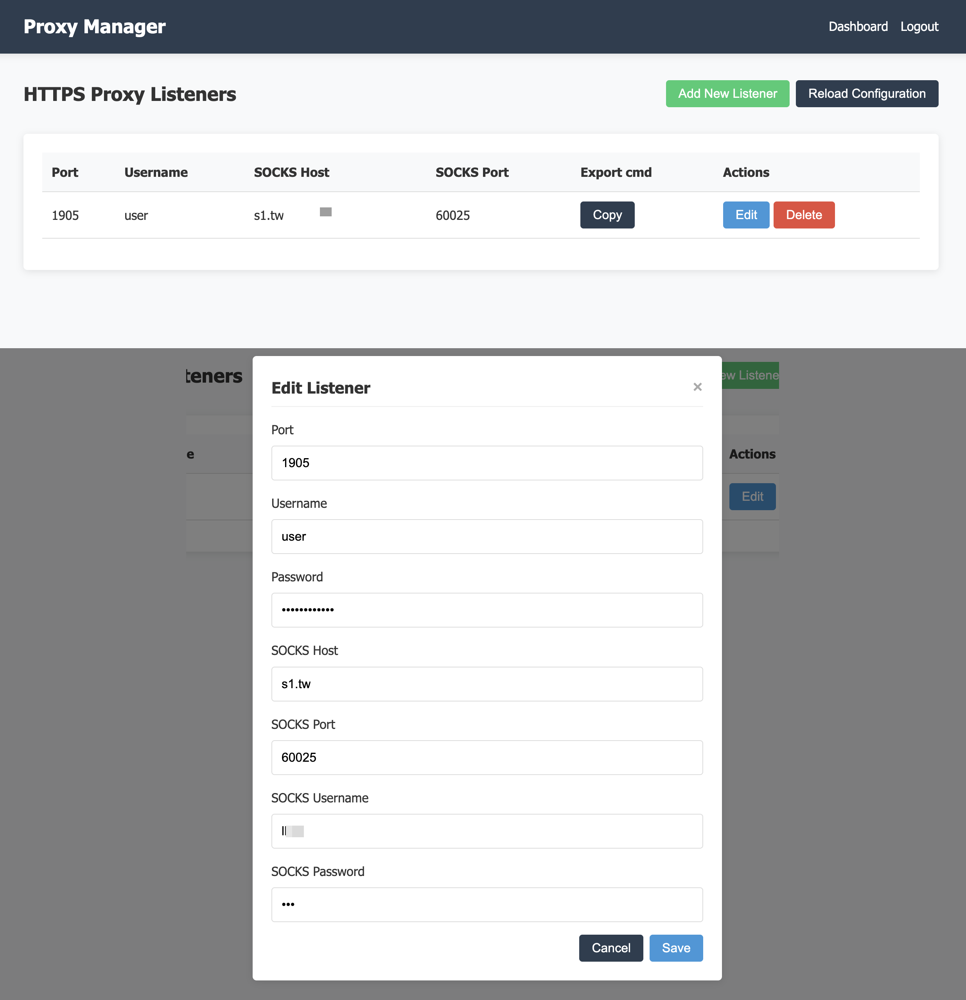

# SOCKS Bridge
*A self‑hosted manager for HTTPS CONNECT proxies that tunnel traffic through SOCKS5.*

---

## Table of Contents
1. [Features](#features)
2. [Quick Start (with Docker)](#quick-start-with-docker)
3. [Configuration](#configuration)
4. [Management UI](#management-ui)
5. [Security Hardening](#security-hardening)
6. [Development & Building](#development--building)
7. [Contributing](#contributing)
8. [License](#license)

---

## Features

- **HTTPS CONNECT proxy farm** &nbsp;— run multiple listeners, each with its own credentials and upstream SOCKS5 endpoint.
- **Web‑based dashboard** &nbsp;— add, edit, or delete listeners and trigger live reloads without restarting the container.
- **Hot‑reloading** &nbsp;— edits to `config.js` (or via the UI) automatically respawn the affected proxy servers in seconds.
- **Stealth mode** &nbsp;— optional authentication masking to disguise the server as a regular website instead of a proxy.
- **Docker‑first design** &nbsp;— a single, minimal image (<60MB) ready for any platform that runs Docker.

---

## Quick Start with Docker

### Prerequisites
- **Docker Engine 20.10+** and **Docker Compose v2**
- A **TLS certificate** (`certificate.crt`) and **private key** (`private.key`) that your clients trust

### 1&nbsp;— Clone the repository
```bash
git clone https://github.com/KevinWang15/socks-bridge.git
cd socks-bridge
```

### 2&nbsp;— Add your TLS materials
```bash
mkdir -p certs
cp /path/to/certificate.crt certs/
cp /path/to/private.key    certs/
```

### 3&nbsp;— Create or edit `config.js`
```javascript
// config.js
module.exports = {
  // TLS paths (inside the container)
  tlsKey : '/app/certs/private.key',
  tlsCert: '/app/certs/certificate.crt',

  // When true, authentication failures return 200 OK with empty JSON
  // instead of 407, masking the proxy but breaking browser compatibility
  maskProxyAuth: false,

  // Management UI credentials
  admin: {
    username: 'admin',
    password: 'change‑me‑now!'
  },

  // One or more HTTPS proxy listeners
  httpsProxyListeners: [
    {
      port  : 8443,            // HTTPS port exposed to clients
      USERNAME: 'proxyUser',   // (optional) basic‑auth credentials
      PASSWORD: 'proxyPass',   //

      SOCKS_HOST: 'localhost', // Upstream SOCKS5 server
      SOCKS_PORT: 1080,
      SOCKS_USERNAME: '',      // (optional)
      SOCKS_PASSWORD: ''       // (optional)
    }
  ]
};
```

> **Tip:** You may mount `config.js` from the host (see *docker‑compose.yml*) or bake it into a custom image.

### 4&nbsp;— Launch the stack
```bash
docker compose up -d
```

### 5&nbsp;— Open the dashboard
Visit **https://&lt;host&gt;:35443** (default) and log in with the admin credentials you set above.

---

## Configuration

| Key | Type | Description |
|-----|------|-------------|
| `tlsKey` / `tlsCert` | *string* | Absolute paths (inside the container) to your PEM‑encoded key and certificate. |
| `maskProxyAuth` | *boolean* | When `true`, authentication failures return a 200 OK with empty JSON instead of 407 errors. This helps mask the server as a proxy but breaks standard browser proxy usage. Default: `false`. |
| `admin.username` / `admin.password` | *string* | Credentials for the management UI (JWT‑based). |
| `httpsProxyListeners[]` | *array* | Each object spawns an independent HTTPS CONNECT proxy. |

### Timeout and Keep‑Alive Tuning
Add an optional `timeouts` object to relax server and socket timeouts and enable TCP keep‑alives to minimize premature disconnects (e.g., long‑lived CONNECT tunnels behind NATs).

Example `config.js` snippet:

```js
timeouts: {
  server: { requestTimeout: 0, headersTimeout: 86400000, keepAliveTimeout: 86400000, socketTimeout: 0 },
  socket: { idleTimeout: 0, keepAlive: true, keepAliveInitialDelayMs: 60000 },
  socks:  { handshakeTimeoutMs: 86400000 }
}
```

Notes:
- `0` disables some timeouts in Node (e.g., `requestTimeout`, server socket timeouts).
- Large values are used where disable semantics are ambiguous (e.g., `headersTimeout`).
- Consider operational risk (e.g., slowloris) before using these settings on a public network.

### Proxy Listener Schema
| Field | Required | Notes |
|-------|----------|-------|
| `port` | ✅ | TCP port that the listener binds (must be unique). |
| `USERNAME` / `PASSWORD` | ⬜ | If omitted, the listener is **open** (no basic‑auth). |
| `SOCKS_HOST` / `SOCKS_PORT` | ⬜ | If omitted, traffic goes **directly** to the target host. |
| `SOCKS_USERNAME` / `SOCKS_PASSWORD` | ⬜ | Credentials for the upstream SOCKS5 server (if it requires auth). |

Edit the file directly or use the **Add Listener** button in the dashboard. Changes are hot‑reloaded.

---

## Management UI



| Action | Description |
|--------|-------------|
| **Add Listener** | Opens a modal to create a new HTTPS listener. |
| **Edit / Delete** | Modify or remove an existing listener. |
| **Reload Configuration** | Forces a manual reload (automatic reload also occurs on any change). |
| **Copy Export Cmd** | Copies `export https_proxy=https://…` to your clipboard for quick client setup. |

---

## Security Hardening

> SOCKS Bridge is production‑grade — but *your* deployment practices determine how secure it really is.

1. **Replace the default admin password** immediately.
2. **Use a trusted certificate** so clients can verify the proxy; self‑signed is fine for internal use.
3. **Restrict access** to the management UI (firewall, VPN, or network ACLs).
4. **Run behind a reverse proxy** (nginx, Traefik, Caddy) if you need additional protections like rate‑limiting or IP allow‑lists.
5. **Keep images up to date** — pull the latest tag or rebuild on a schedule.

---

## Development & Building

```bash
# Install dev dependencies
npm install

# Auto‑reload backend during development
npm run dev

# Build the Docker image locally
docker build -t socks-bridge:dev .
```

### Folder Structure
```
├─ api/            # REST endpoints (auth & config)
├─ middleware/     # Express middlewares
├─ public/         # Static SPA assets (HTML/CSS/JS)
├─ utils/          # Helper modules (config, proxy, TLS)
├─ server.js       # Entry point (Express + HTTPS)
└─ docker-compose.yml
```

---

## Contributing
Pull requests, bug reports, and feature ideas are welcome! Please open an issue to discuss your proposal before submitting large changes.

1. Fork the repository and create your branch: `git checkout -b feat/my-feature`
2. Commit your changes: `git commit -am 'Add new feature'`
3. Push to the branch: `git push origin feat/my-feature`
4. Open a PR against **main**.

---

## License

MIT
